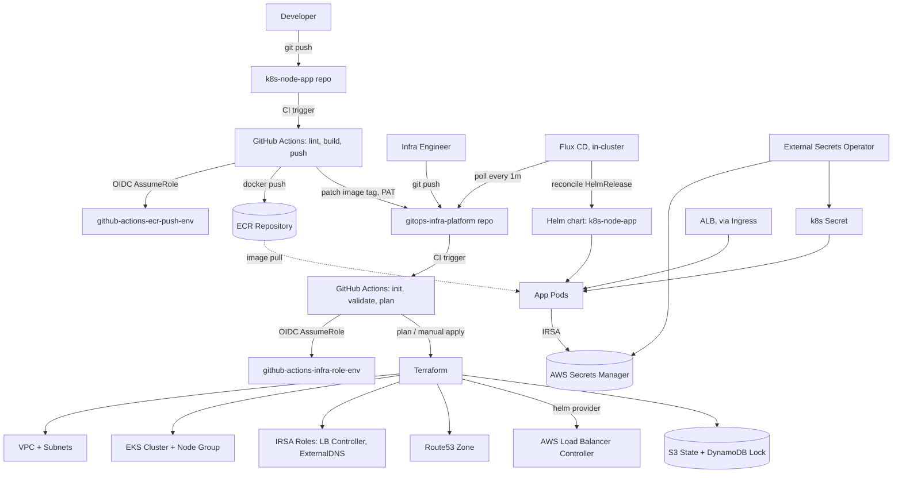

# Architecture

## System overview

## Components

### Application (`k8s-node-app`)
A single-container Flask service exposing `/health` and `/nodes`. `/nodes` calls the Kubernetes API server (via the official Python client, in-cluster config) and lists nodes, flagging which one the pod itself is scheduled on — used to demonstrate RBAC-scoped API access from within a pod rather than any real business function. The container runs as a non-root UID (`10001`) and is built as a two-stage image (build deps discarded from the final layer).

### Delivery pipeline (`k8s-node-app/.github/workflows/ci-cd.yaml`)
Three sequential jobs: lint → build & push to ECR (tagged by branch and commit SHA) → patch the target environment's Flux `HelmRelease` manifest in the infra repo and push. Authentication to AWS uses GitHub OIDC (no static keys); authentication to the infra repo uses a GitHub PAT (`GITHUB_TOKEN_PATCH`), since `GITHUB_TOKEN` cannot write to a different repository.

### Infrastructure (`gitops-infra-platform/terraform`)
Organized as reusable modules (`network`, `eks`, `iam`, `dns`, `ecr`) consumed by three independent root modules — one per environment — each with its own S3/DynamoDB backend and `.tfvars` file. The `eks` module wraps the community `terraform-aws-modules/eks/aws` module; the `iam` module hand-builds the node group role and IRSA roles for cluster add-ons (Load Balancer Controller, ExternalDNS) using `sts:AssumeRoleWithWebIdentity` trust policies scoped to specific `system:serviceaccount:` subjects via the cluster's OIDC issuer.

### GitOps delivery (`gitops-infra-platform/flux`)
Flux CD watches this repository directly from inside each cluster. `flux/clusters/<env>/apps.yaml` points Flux at `flux/apps/environments/<env>`, which contains per-environment `HelmRelease` and `ExternalSecret`/`SecretStore` manifests referencing the shared chart in `k8s-node-app`. A Kyverno `ClusterPolicy` (`restrict-manual-secrets.yaml`) denies manual `Secret` creation in the app namespace, forcing all secrets through External Secrets Operator, which pulls from AWS Secrets Manager.

### Networking
Traffic reaches pods through an `Ingress` provisioned as an internet-facing ALB by the AWS Load Balancer Controller (installed via Terraform's `helm` provider, using an IRSA role built by the `iam` module). TLS is not currently terminated at the ALB — the ACM certificate annotation is commented out in `ingress.yaml`.

### State and identity
Each environment has an isolated S3 bucket + DynamoDB table for Terraform state/locking, created by the bootstrap script rather than Terraform itself (a deliberate chicken-and-egg break — see Design Decisions). A single GitHub OIDC provider is shared across all environments; per-repository, per-environment IAM roles scope what each pipeline can do.

## Request flow (application)

1. Client → ALB (public) → `Service` (ClusterIP) → Pod
2. Pod → Kubernetes API server (in-cluster, via ServiceAccount token) for `/nodes`
3. Pod → AWS Secrets Manager, indirectly: secrets are synced by External Secrets Operator into a native `Secret` at deploy time and consumed as env vars, not fetched live per-request
